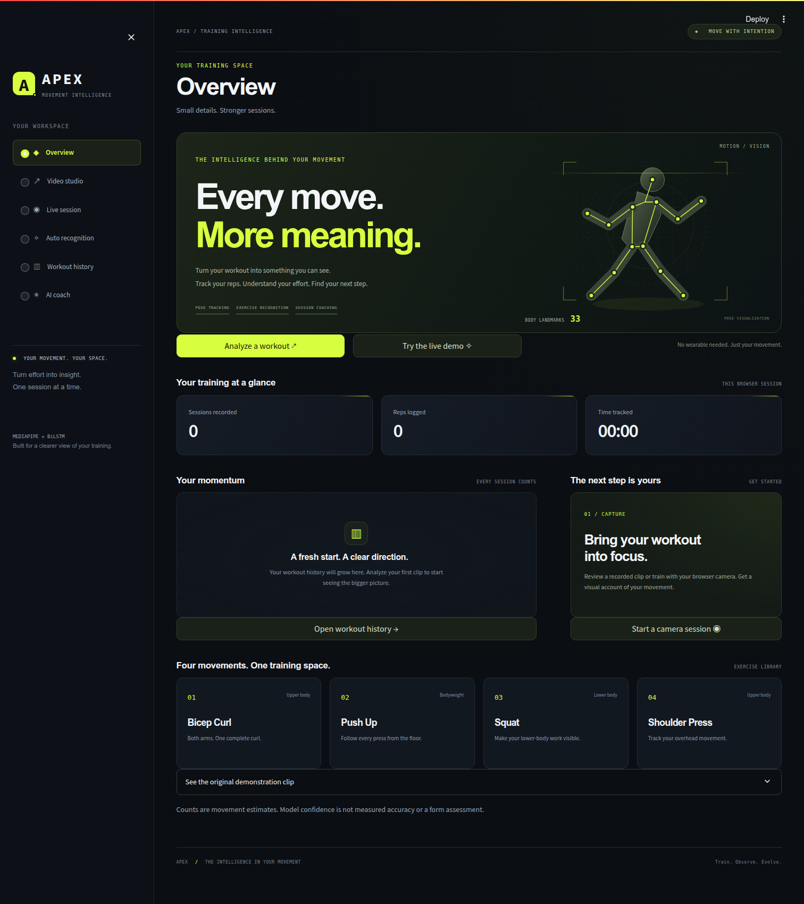
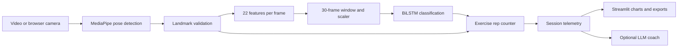

# APEX — AI Gym Tracker

APEX turns workout video into an annotated recording and a session summary. It uses
MediaPipe to track body landmarks, a BiLSTM model to recognize exercises, and joint
angles to count repetitions. The Streamlit app supports uploaded clips and a live
browser camera, with an optional coach that answers questions about your recorded workout.



[Features](#features) · [Setup](#setup) · [Project structure](#project-structure) ·
[Architecture](#architecture) · [Evaluation](#evaluation) · [Author](#author)

## Features

- **Video studio:** analyze a clip, review annotated playback, and download the result.
- **Live session:** track movement through the browser camera with exercise-specific framing guidance.
- **Auto recognition:** classify bicep curls, push-ups, squats, and shoulder presses.
- **Workout history:** explore rep timelines, exercise breakdowns, and session duration.
- **Session export:** download exercise counts, timestamps, duration, tracking coverage, and model confidence as JSON.
- **AI coach:** ask questions using the selected session's structured telemetry as context.

Manual exercise selection bypasses the classifier. Automatic mode uses the bundled
model; displayed confidence is a model probability, not measured accuracy.

## Setup

### Requirements

Use **Python 3.11**. The pinned environment targets Linux x86-64; Docker provides the
same runtime on supported hosts. On Debian or Ubuntu, install the OpenCV system libraries:

```bash
sudo apt-get update
sudo apt-get install -y libgl1 libglib2.0-0
```

From the repository root:

```bash
python3.11 -m venv .venv
source .venv/bin/activate
python -m pip install -r requirements.lock
python -m pip check
streamlit run streamlit_app.py
```

Open the local address printed by Streamlit. For development, install
`requirements-dev.txt`, which includes the locked runtime plus pytest and Ruff.
`requirements.txt` lists direct runtime dependencies; `requirements.lock` also pins
transitive dependencies. Run from source with `models/` and `assets/` alongside
`gym_tracker/`. Use the included OpenCV contrib package without installing another
OpenCV distribution into the same environment.

### Optional coaching

Copy `.env.example` to `.env` and set `COACH_PROVIDER`, `COACH_MODEL`, and the matching
API key. Supported providers are OpenRouter and Anthropic. Streamlit secrets are
also supported. Select a model available in your provider account; video tracking
works without an API key. Keep `.env` and `.streamlit/secrets.toml` out of Git.

The coach receives workout telemetry and your question. It does not receive the
video or inspect exercise technique.

## Using the app

In **Video studio**, choose an exercise, upload a clip, and select **Analyze video**.
The included curl demo can be selected without an upload. Use **Auto recognition**
when the model should choose the exercise. Completed sessions appear in **Workout
history**, where you can review charts and export telemetry.

For **Live session**, choose an exercise and press **START**. Allow camera access
and use **SELECT DEVICE** if needed. Press **STOP** to finish; the joined-wrists
gesture also ends tracking. Use **Refresh workout metrics** to update the summary.

| Exercise | Framing in manual mode | When a rep is counted |
| --- | --- | --- |
| Bicep curl | Both shoulders, elbows, and wrists visible | Both arms curl after extension |
| Shoulder press | Both arms visible, including overhead | Both arms extend after bent elbows |
| Push-up | Side view with a shoulder, elbow, and wrist visible | Descent after arm extension |
| Squat | Side view with a hip, knee, and ankle visible | Descent after standing extension |

Push-ups and squats count on descent, preserving the existing counting convention.
Automatic recognition requires the full-body landmarks used by the classifier.

The camera needs **localhost or HTTPS**. Choose **This computer / local network**
for a local app. For a hosted app, choose **Remote server / cloud** and configure
`WEBRTC_ICE_SERVERS` if the network requires a TURN relay; see `.env.example`.
If loading stalls, check camera permission, close other apps using the camera,
and confirm the connection mode. Install the locked dependencies and restart
Streamlit after updating the project.

### Screenshots and demo clips

[Session analysis](docs/screenshots/session_analysis.png) ·
[Workout history](docs/screenshots/workout_history.png) ·
[Mobile view](docs/screenshots/mobile.png) ·
[Annotated frame](docs/screenshots/annotated_frame.jpg)

The repository includes a [curl clip](assets/videos/bicep_curl_demo.mp4) and a
[shoulder-press clip](assets/videos/shoulder_press_demo.mp4). These are demonstration
inputs without verified rep annotations, not an evaluation dataset.

## Project structure

```text
.
├── streamlit_app.py             # Streamlit entry point
├── gym_tracker/                 # Application package
│   ├── pose.py                  # MediaPipe detector lifecycle
│   ├── features.py              # Landmark validation and feature extraction
│   ├── classification.py        # BiLSTM inference and shared model cache
│   ├── repetitions.py           # Exercise counting state machines
│   ├── analytics.py             # Session metrics and timestamps
│   ├── coaching.py              # Telemetry-based coaching requests
│   ├── pipeline.py              # Frame processing orchestration
│   ├── video.py                 # Video decoding and annotated output
│   ├── evaluation.py            # Classification metric calculations
│   └── ui/                     # Streamlit views, components, webcam, and CSS
├── models/
│   ├── exercise_bilstm.h5       # Exercise classifier weights
│   ├── feature_scaler.pkl      # Fitted window scaler
│   ├── label_encoder.pkl       # Model output labels
│   ├── manifest.json           # Artifact metadata and SHA-256 checksums
│   └── README.md               # Model provenance and compatibility
├── assets/videos/              # Demonstration clips
├── scripts/                    # Dataset preparation, evaluation, benchmarking
├── tests/                      # Unit, integration, and Streamlit tests
├── docs/
│   ├── architecture.md         # Feature, counting, and telemetry contracts
│   ├── validation.md           # Checks performed and remaining gaps
│   └── screenshots/            # Actual application screenshots
├── .github/workflows/ci.yml     # Dependency checks, lint, and tests
├── .streamlit/config.toml       # Theme and upload limits
├── .devcontainer/              # Development container configuration
├── .env.example                # Optional provider and WebRTC settings
├── Dockerfile                  # Non-root runtime with health check
├── pyproject.toml              # Project metadata and tool settings
├── requirements.txt            # Direct runtime dependency pins
├── requirements.lock           # Resolved runtime dependencies
├── requirements-dev.txt        # Runtime plus development tools
├── packages.txt                # System packages for Streamlit hosting
├── runtime.txt                 # Hosting Python version
└── .python-version             # Local Python version
```

Generated reports, private datasets, local secrets, virtual environments, and
Python/tool caches are ignored. Store evaluation outputs under `reports/` and
local evaluation data under `data/`.

## Architecture



The inference package does not depend on Streamlit. The UI starts a tracker and
renders its output; the tracker owns pose detection, counting, and session state.
Each video or camera stream creates one MediaPipe detector. The classifier, scaler,
and label encoder load once per process with synchronized loading and prediction.
Camera model initialization runs in the frame worker after connection setup.
Models are never instantiated per frame.

### Model and counting pipeline

MediaPipe returns 33 landmarks with x/y/z coordinates and visibility. Twelve joints
produce 22 features: eight angles, twelve normalized 3D distances, and two normalized
vertical distances. Thirty consecutive valid frames form one classification window.
The scaler transforms 660 flattened values before reshaping to `(1, 30, 22)`.

The bundled network has two bidirectional LSTM layers, each with 91 units per
direction, dropout, and a four-class softmax output. The original model weights
and label mapping are preserved. Classification runs on nonoverlapping windows.

Rep counting uses interior joint angles with separate thresholds for each exercise.
Tracking gaps reset pending phases. Push-ups and squats keep one visible side and
reset if tracking switches sides. See [architecture.md](docs/architecture.md) for
thresholds and telemetry definitions, and [models/README.md](models/README.md) for
artifact provenance.

Session telemetry includes exercise, reps, attributed duration, confidence when
classification runs, UTC session timestamps, and rep offsets in seconds. Uploaded
video uses its frame clock; live sessions use a monotonic clock. Sessions remain
in server memory for the current browser session and can be exported as JSON.

## Evaluation

No validated classification accuracy is published with this repository. The
original training data and split membership are unavailable. Evaluate with real,
human-labeled clips and keep subjects and source videos separate across train,
validation, and test partitions. Do not fit the scaler on test data.

Create `data/manifest.csv` with columns `path,exercise,subject_id,split`. Video paths
are relative to the manifest. Use single-exercise clips and the canonical labels
`bicep_curl`, `push_up`, `squat`, and `shoulder_press`. Valid splits are `train`,
`validation`, and `test`.

```bash
python -m scripts.prepare_dataset data/manifest.csv --split test --output data/test.npz
python -m scripts.evaluate data/test.npz \
  --split-description "Dataset source, held-out subjects, and recording sessions" \
  --output reports/evaluation.json
```

The evaluator accepts unscaled `X` with shape `(N, 30, 22)` and string labels `y`
with shape `(N,)`. It reports accuracy, per-class/macro/weighted precision, recall,
F1, support, and a confusion matrix with explicit class order. Rows are true labels;
columns are predictions. Undefined metrics are set to zero. Dataset and artifact
hashes are included for traceability.

Publish the preparation script's coverage report alongside the metrics: failed
poses and incomplete windows are excluded. The manifest checks subject separation
and duplicate video paths within the supplied dataset, but cannot prove separation
from the unknown original training set. Window classification metrics do not
measure rep-count accuracy, pose accuracy, or coaching quality.

### Performance benchmark

```bash
python -m scripts.benchmark assets/videos/bicep_curl_demo.mp4 --exercise auto \
  --warmup 30 --max-frames 300 --output reports/benchmark.json
```

The benchmark measures decoding, pose estimation, feature extraction, scheduled
classification, counting, and annotation. It records initialization time, mean and
p50/p95 frame processing time, throughput, classification window count, and runtime
and machine details. UI, network transport, and output encoding are excluded.
Report the hardware, input, and warmup with any timing result; these timings are
not end-to-end browser latency.

## Development and deployment

```bash
python -m pip install -r requirements-dev.txt
pytest -q
ruff check .
```

Tests cover feature geometry, missing and invalid landmarks, rep transitions,
mirroring, side changes, classifier output, model caching, session telemetry,
coaching requests, metric calculations, video output, and Streamlit interactions.
Real-runtime smoke tests load the bundled model and MediaPipe. Synthetic poses
verify counting behavior; they are not recognition evaluation data.
See [validation.md](docs/validation.md) for recorded checks and their scope.

```bash
docker build -t apex-gym-tracker .
docker run --rm -p 8501:8501 apex-gym-tracker
```

Add `--env-file .env` before the image name to enable configured coaching.
The container runs as a non-root user and exposes a health check. GitHub Actions
installs the locked runtime, checks dependencies, lints, and runs tests.
For Streamlit hosting, select `streamlit_app.py` and Python 3.11; the repository
includes `requirements.txt` and `packages.txt`. Configure secrets in the host's
dashboard. Verify Docker and remote camera connectivity on the target environment.

## Limitations

- Recognition is limited to one person and four exercises. There is no trained
  unknown-exercise class or calibrated confidence threshold.
- Counts depend on camera angle, joint visibility, and movement range. They do
  not establish correct technique or exercise safety.
- Original training code, data, and split information are missing, so model
  training cannot currently be reproduced. Artifact provenance is documented separately.
- Classification windows depend on capture FPS. Variable-frame-rate footage can
  affect timing, and the original training sampling rate is undocumented.
- Workout history is temporary: up to 20 summaries and one compressed result video
  are retained per browser session. There are no accounts or durable storage.
- Uploaded and compressed video bytes consume memory. The configured upload limit
  is 100 MB; size hosting resources accordingly. Live processing can drop frames.
- Coaching can make mistakes and only sees recorded telemetry. It cannot judge form.
- The ML dependency versions are pinned for artifact compatibility. Upgrades need
  compatibility checks before deployment.

## Author

**Created by P SAIDEEP REDDY.**

APEX brings together exercise tracking, workout analytics, and a Streamlit interface
for reviewing training sessions. Creator credit is also available in the app's
footer and **About & credits** section.

### Acknowledgements

Built with Streamlit, MediaPipe, TensorFlow/Keras, scikit-learn, OpenCV, and
streamlit-webrtc. The bundled model artifacts and demonstration clips are retained
from the existing project; their available provenance is recorded in
[models/README.md](models/README.md).
