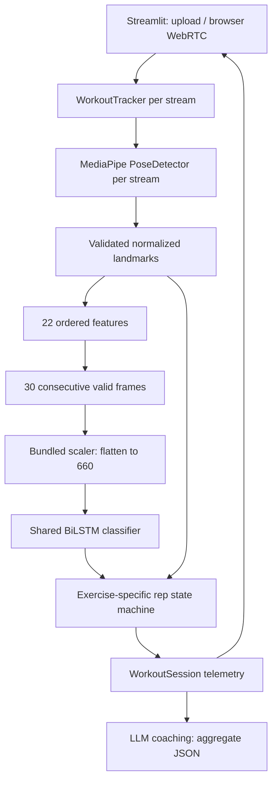

# Architecture and contracts

Manual mode bypasses the classifier and uses the selected exercise. Auto mode
classifies nonoverlapping windows, retaining the latest prediction between
windows. This reproduces the original scheduling. It does not pad initial frames
or call the classifier once per frame. A tracking gap clears the pending window,
prediction and rep phases. Changing predicted exercises also clears phases, but
preserves accumulated counts for each exercise.

The classifier cache is keyed by resolved artifact directory and protected by a
load lock. It is populated only after all three artifacts validate successfully.
Prediction uses a separate lock because the same resources serve multiple browser
sessions. Each tracker owns a single MediaPipe instance, counter set and analytics
object; none are global. Tracker processing, snapshots and close are synchronized.
Closing is idempotent. Streamlit functions are confined to `gym_tracker/ui/`.

## Feature contract

Input landmarks have shape `(33,4)` with x, y, z, visibility columns. The twelve
required indices are 11–16 and 23–28. All values must be finite and required
landmark visibility must be at least 0.5. Zero x/y/z is valid. No pose, low
visibility or zero-length angle vectors produce no classification features.

The original feature order is eight x/y angles, twelve 3D distances and two
absolute y distances. Distances are divided by the first positive length among
left shoulder–hip, right shoulder–hip, left hip–knee, right hip–knee. Angles remain
degrees in `[0,180]`. Features are flattened frame-major to 660 values, transformed
by the existing scaler, then reshaped to `(1,30,22)` for inference. Raw landmark
coordinates themselves are not model inputs.

Repetition counting uses pixel coordinates to preserve frame aspect ratio.
All counters convert joint angles to interior angles in `[0,180]` so horizontal
mirroring cannot change the movement phase. Curls require both arms to extend
(right >160°, left >140°) then flex below 60°. Push-ups use ≥140° then ≤120°;
squats use ≥160° then ≤140°, retaining the extension-to-flexion counting transition.
Push-ups and squats track a visible shoulder–elbow–wrist or hip–knee–ankle chain.
The selected side remains fixed while visible; switching sides resets the phase.
Shoulder presses use interior elbow angles, making horizontal mirroring safe:
both elbows must reach at most 110°, followed by at least 155° to count a press.
Both wrists must be above the shoulders; losing this position or arm visibility
resets the pending phase. Manual shoulder presses and curls only require arm visibility,
while auto mode still requires all classifier joints. The separated thresholds
prevent repeated counts while holding extension. These are heuristic motion
phases, not validated form assessment; automated tests use synthetic poses.

## Telemetry

Sessions include schema version, UUID, source, UTC start/end timestamps, elapsed
seconds, decoded/received frames, valid pose frames and per-exercise metrics.
Each exercise includes reps, attributed duration, mean classifier confidence,
number of classification windows, first/last observation offsets and rep offsets.
Offsets use seconds from the start of the video/stream. UTC timestamps describe
analysis wall time, not the original recording date.

Uploaded video time is decoded frame count / declared FPS. Webcam time uses a
monotonic clock. The elapsed interval ending at each frame is attributed to the
active exercise only if that frame has a valid pose; warmup and invalid frames
contribute unassigned time. Durations are observations, not exact set boundaries.
Variable-frame-rate sources should be converted to constant FPS before analysis.

Confidence averages the winning softmax probability once per prediction window.
It is uncalibrated and is not accuracy, pose confidence or form quality. Manual
mode reports null confidence. No calories or injury/safety scores are inferred.

Video encoding streams frames to FFmpeg and closes capture, encoder and tracker
in `finally` blocks. The UI retains one compressed result video and up to twenty
session summaries per browser. JSON export is the persistence mechanism; this demo
does not include a user database. Webcam metric refresh occurs on UI reruns.

## Coaching

Coaching requires a nonempty session. The request contains aggregate exercise,
reps, duration, confidence, window counts and tracking coverage plus the question.
It excludes raw video, frames, session identifiers and individual rep timestamps.
Provider and model are configured explicitly; there are no assumed free models
or silent fallbacks. Calls have a 30-second timeout and response validation.

API references: [OpenRouter chat completions](https://openrouter.ai/docs/api/api-reference/chat/send-chat-completion-request)
and [Anthropic API overview](https://platform.claude.com/docs/en/api/overview).
